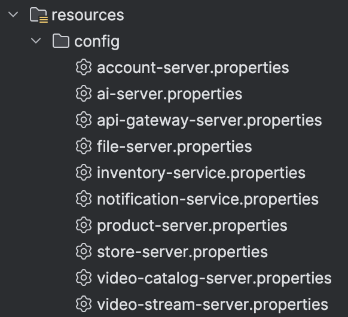

# Spring Cloud 'Event-Driven' Microservice
I have created a project to 
<br/>
# Introduction

<br/>
I have designed an event-driven microservice 

<br/>
# Spring Cloud

<br/>
## 1. Config Server
Spring Cloud Config provides server and client-side support for externalized configuration in a distributed system. With the Config Server you have a central place to manage external properties for applications across all environments.

```properties
spring.application.name=config-server
server.port=8888
spring.profiles.active=native
```
The configurations can be pulled from Backend File System or Git repo. For this project I have located the congiuration files under config server's resources directory.
<br/>


<br/>
## 2. Circuit Breaker - Resilience4j


<br/>
## 3. Gateway Reactive
I have used the Fluent Java Routes APi since I am using Reactive for my gateway. In this way I can easily manage and update routes.
### Fluent Java Routes API
```java
@Bean
public RouteLocator customRouteLocator(RouteLocatorBuilder builder) {
    return builder.routes()
            .route(userRoute -> userRoute.path("/usr/**")
                    .filters(f -> f
                            .addResponseHeader("X-Powered-By", "Fiorano Gateway Service")
                    )
                    .uri("http://localhost:8081")
    
            )
            .route(storeRoute -> storeRoute.path("/str/**")
                    .filters(f -> f
                            .addResponseHeader("X-Powered-By", "Fiorano Gateway Service")
                    )
                    .uri("http://localhost:8082")
    
            )
            
            << ... skip ... >>
            
        .build();
```


<br/>
## 4. Netflix Eureka Service Registry


<br/>
## 5. Security


<br/>
# Spring Boot Actuator
Actuator endpoints let you monitor and interact with your application.

Configuration
```properties
management.endpoints.web.exposure.include=*
management.endpoint.health.show-details=always
management.info.env.enabled=true

# For the actuator/info page
info.app.name=Account Server
info.app.description=Account(User) Management Service
info.app.version=1.0.0
info.app.author=Daniel Choi
```

# Server Side Event - SSE
## Kafka
I have integrated Kafaka for ordering service since Kafka is designed for handling large volumes of data with minimal latency.

## RabbitMQ
I have implemented RabbitMQ for Notification service since RabbitMQ is versatile and flexible, supporting muti-protocols.


<br/>
# Microservices
<br/>

<br/>
## Load Balancer
<br/>
Dependency
<br/>


<br/>
## Rest Template
I have implemented Rest Template to accomplish communication between the services.
```java
@Configuration
public class RestConfig {

    @LoadBalanced
    @Bean
    public RestTemplate restTemplate() {
        return new RestTemplate();
    }
}
```

<br/>
# Databases
## MariaDB


## MongoDB


## PostgreSQL


# Build & Deploy
## Docker


## Kubernetes


