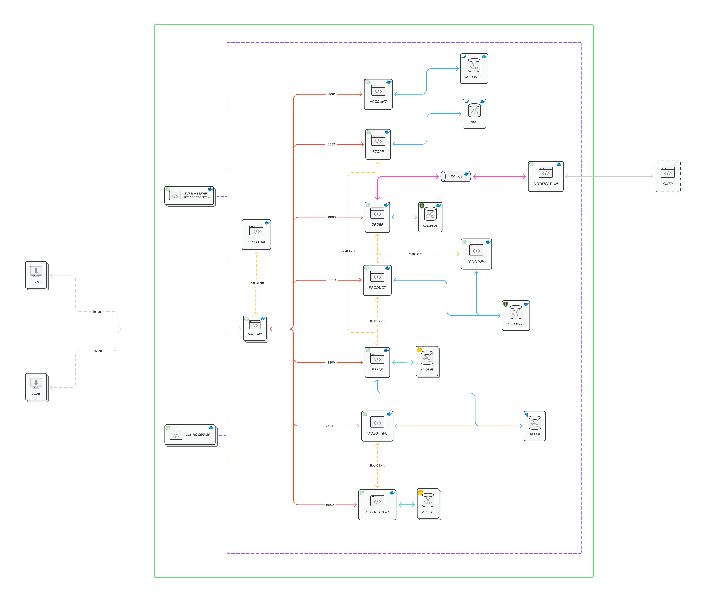

# Spring Cloud 'Event-Driven' Microservice

# Introduction



# Spring Cloud

## Config Server
Spring Cloud Config provides server and client-side support for externalized configuration in a distributed system. With the Config Server you have a central place to manage external properties for applications across all environments.

```properties
spring.application.name=config-server
server.port=8888
spring.profiles.active=native
```
The configurations can be pulled from Backend File System or Git repo. For this project I have located the congiuration files under config server's resources directory.
<br/>


## Circuit Breaker - Resilience4j


## Gateway Reactive
### Fluent Java Routes API
```java
@Bean
public RouteLocator customRouteLocator(RouteLocatorBuilder builder) {
    return builder.routes()
            .route(userRoute -> userRoute.path("/usr/**")
                    .filters(f -> f
                            .addResponseHeader("X-Powered-By", "Fiorano Gateway Service")
                    )
                    .uri("http://localhost:8081")
    
            )
            .route(storeRoute -> storeRoute.path("/str/**")
                    .filters(f -> f
                            .addResponseHeader("X-Powered-By", "Fiorano Gateway Service")
                    )
                    .uri("http://localhost:8082")
    
            )
            
            << ... skip ... >>
            
        .build();

```

## Netflix Eureka Service Registry

## Security

# Spring Boot Actuator
Actuator endpoints let you monitor and interact with your application.

Configuration
```properties
management.endpoints.web.exposure.include=*
management.endpoint.health.show-details=always
management.info.env.enabled=true

# For the actuator/info page
info.app.name=Account Server
info.app.description=Account(User) Management Service
info.app.version=1.0.0
info.app.author=Daniel Choi
```

# Microservices
## Load Balancer
## Rest Template

# Databases
## MariaDB

## MongoDB


## PostgreSQL


# Deployment
## Docker


## Kubernetes


