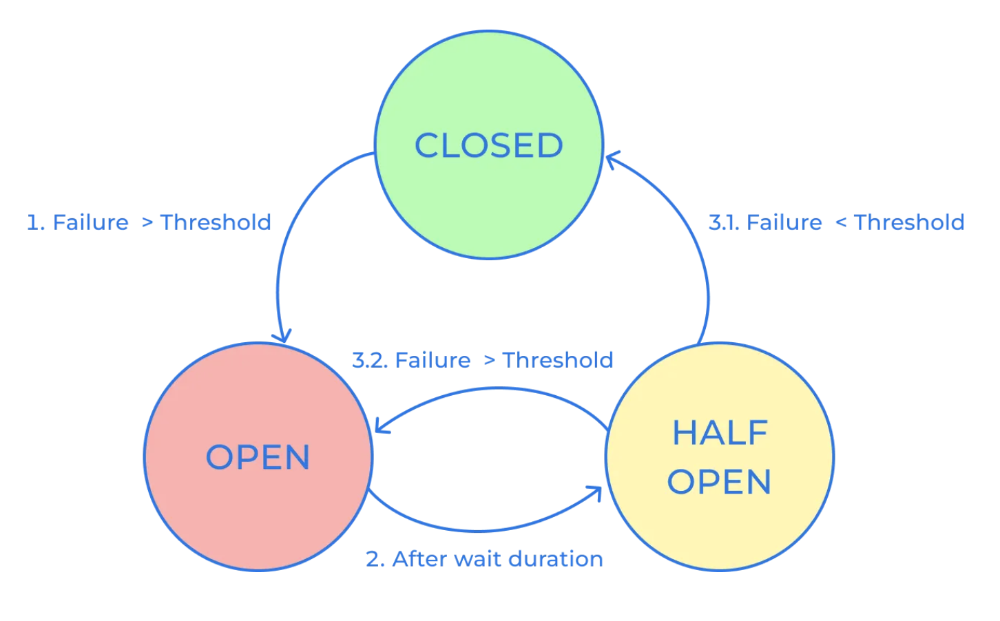

# Spring Cloud Gateway Reactive

I have used the Fluent Java Routes APi since I am using Reactive for my gateway. In this way I can easily manage and
update routes.

## Fluent Java Routes API

```java

@Bean
public RouteLocator customRouteLocator(RouteLocatorBuilder builder) {
    return builder.routes()
            .route(userRoute -> userRoute.path("/usr/**")
                    .filters(f -> f
                            .addResponseHeader("X-Powered-By", "Fiorano Gateway Service")
                    )
                    .uri("http://localhost:8081")
            )
            .route(storeRoute -> storeRoute.path("/str/**")
                    .filters(f -> f
                            .addResponseHeader("X-Powered-By", "Fiorano Gateway Service")
                    )
                    .uri("http://localhost:8082")
            )
            .build();
}
```

You can find more endpoints for your routes here:
https://docs.spring.io/spring-boot/reference/actuator/endpoints.html

## Circuit Breaker - Resilience4j

A distributed system, which comprises many services interacting to achieve business goals, is prone to failures in the
chain of service dependencies.
Suppose service A calls service B, which calls service C, but C does not respond. Service C may be down, or overloaded,
and take a long time to respond, causing errors that may cascade and cause the system to fail.

**According to Chris Richardson's *"Microservice Patterns"*:**

***A service client should invoke a remote service via a proxy that functions in a similar fashion to an electrical
circuit breaker.
When the number of consecutive failures crosses a threshold, the circuit breaker trips, and for the duration of a
timeout period all attempts to invoke the remote service will fail immediately.
After the timeout expires the circuit breaker allows a limited number of test requests to pass through.
If those requests succeed the circuit breaker resumes normal operation. Otherwise, if there is a failure the timeout
period begins again.***

For example, if the Store service fails due a sudden surge in traffic, the circuit breaker will cut off to the service.
After a
certain amount of time breaker will let part of the traffic in to check if the service operates as normal.
If it checks out to be ok, then breaker will let the service back to the original state.



#### Configurations:

```properties
resilience4j.circuitbreaker.configs.default.register-health-indicator=true
resilience4j.circuitbreaker.configs.default.sliding-window-type=COUNT_BASED
resilience4j.circuitbreaker.configs.default.sliding-window-size=10
resilience4j.circuitbreaker.configs.default.failure-rate-threshold=50
resilience4j.circuitbreaker.configs.default.wait-duration-in-open-state.seconds=3
resilience4j.circuitbreaker.configs.default.automatic-transition-from-open-to-half-open-enabled=true
resilience4j.circuitbreaker.configs.default.minimum-number-of-calls=5
resilience4j.timelimiter.configs.default.timeout-duration.seconds=3
resilience4j.retry.configs.default.max-attempts=3
resilience4j.retry.configs.default.wait-duration.seconds=2
```

```java

@Bean
public RouteLocator customRouteLocator(RouteLocatorBuilder builder) {
    return builder.routes()
            // Account Route
            .route("account_route", accoutnRoute -> accoutnRoute
                    .path("/account/**")
                    .filters(f -> f
                            .circuitBreaker(breaker -> breaker
                                    .setName("account_breaker")
                                    .setFallbackUri("forward:/fallback")
                            )
                            .addResponseHeader("X-Powered-By", "MSC Gateway Service")
                    )
                    .uri("http://localhost:8081")

            )
            // skip //
            .build();

}
```

## Security - Keycloak

When it comes to hacking prevention, Keycloak offers a more comprehensive set of features than Spring Security. Keycloak
provides advanced features like multi-factor authentication (MFA), brute force protection, and CAPTCHA support. MFA adds
an extra layer of security by requiring users to provide additional authentication factors besides their password, such
as a fingerprint or a security token. Brute force protection prevents attackers from repeatedly guessing passwords by
locking out the user’s account after a certain number of failed login attempts. CAPTCHA support helps prevent automated
bot attacks by requiring users to solve a puzzle or answer a question before logging in.

#### A. Up and running the Keycloak

For this project you need to deploy a keycloak container with its own database for metadata.

```shell
  docker compose up -d
```

```yaml
  keycloak:
    container_name: keycloak
    image: quay.io/keycloak/keycloak:26.2.0
    command: [ "start-dev", "--import-realm" ]
    environment:
      DB_VENDOR: MARIADB
      DB_ADDR: mariadb
      DB_DATABASE: keycloak
      DB_USER: root
      DB_PASSWORD: fiorano1q2w
      KEYCLOAK_ADMIN: admin
      KEYCLOAK_ADMIN_PASSWORD: admin
    ports:
      - "8181:8080"
    volumes:
      - ./container/keycloak/realms/:/opt/keycloak/data/import
    depends_on:
      - mariadb-keycloak
```

#### B. Setting up the keycloak client

Now you can login to the keycloak dashboard and create a client for this project.
<br/>
After creating the credential, you can access the OpenID endpoints through the link provided under 'Realm settings'.

#### C. API Gateway security configuration

```java

@Bean
public SecurityFilterChain securityFilterChain(HttpSecurity http) throws Exception {
    return http.authorizeHttpRequests(authorizeRequests ->
                    authorizeRequests.anyRequest()
                            .authenticated())
            .oauth2ResourceServer(oauth2 ->
                    oauth2.jwt(Customizer.withDefaults()))
            .build();
}
```

Above configuration will redirect all requests to the Keycloak authentication server.
The Keycloak authentication server then will handle issuing and validating JWT.

## API - Swagger

The Swagger aka. OpenAPI has become a standard for API documentation which is crucial for managing APIs efficiently.
It simplifies API development by documenting, designing and consuming RESTful services.

```properties
springdoc.swagger-ui.path=/swagger-ui.html
springdoc.api-docs.path=/api-docs
springdoc.swagger-ui.urls[0].name=Account Server
springdoc.swagger-ui.urls[0].url=/aggregate/account-server/v3/api-docs
springdoc.swagger-ui.urls[1].name=Store Server
springdoc.swagger-ui.urls[1].url=/aggregate/store-server/v3/api-docs
```

```java

@Bean
public RouteLocator customRouteLocator(RouteLocatorBuilder builder) {
    return builder.routes()
            // SKIP //
            .route("account_swagger_route", accountSwaggerRoute -> accountSwaggerRoute
                    .path("/aggregate/account-service/v3/api-docs")
                    .filters(f -> f
                            .circuitBreaker(breaker -> breaker
                                    .setName("account_swagger_breaker")
                                    .setFallbackUri("forward:/fallback")
                            )
                    )
                    .uri("http://localhost:8081")
            )
            // SKIP//
            .build();
}
```

## Monitoring - Actuator

Spring Boot Actuator is a sub-project of Spring Boot that provides a set of built-in production-ready features to help
you monitor and manage your application.
Actuator includes several endpoints that allow you to interact with the application, gather metrics, check the health,
and perform various management tasks.

```properties
management.endpoints.web.exposure.include=*
management.endpoint.health.show-details=always
management.info.env.enabled=true
# For the actuator/info page
info.app.name=Account Server
info.app.description=Account(User) Management Service
info.app.version=1.0.0
info.app.author=Daniel Choi
```