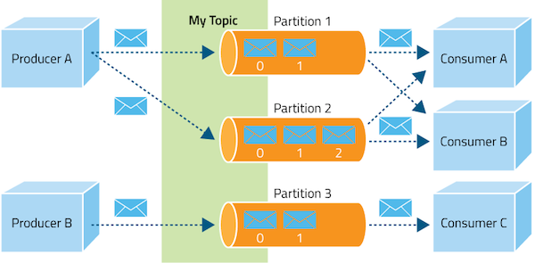

# Order Microservice

## API - Swagger

The Swagger aka. OpenAPI has become a standard for API documentation which is crucial for managing APIs efficiently.
It simplifies API development by documenting, designing and consuming RESTful services.

```properties
springdoc.swagger-ui.path=/swagger-ui.html
springdoc.api-docs.path=/api-docs
```

```java

@Configuration
public class OpenApiConfig {
    @Bean
    public OpenAPI openAPI() {
        return new OpenAPI()
                .info(new Info().title("Order Service")
                        .description("REST API Docs for order service")
                        .version("1.0.0")
                        .license(new License().name("Apache 2.0")))
                .externalDocs(new ExternalDocumentation()
                        .description("Order service Wiki")
                        .url("https://github.com/yhdc/spring_cloud_msa/order_service"));
    }
}
```

## Server-toServer Communication - Rest Client

Unlike the other rest client configuration, I have implemented a custom rest client specific to the inventory service.
As shown below, the RestClient is pre-defined with the request URL for the inventory service.

```java

@Configuration
public class RestClientConfig {
    @Bean
    public InventoryRestClient inventoryRestClient() {
        final String inventoryUrl = "lb://INVENTORY-SERVICE/inventory";

        HttpComponentsClientHttpRequestFactory requestFactory = new HttpComponentsClientHttpRequestFactory();
        requestFactory.setConnectTimeout(30000);
        requestFactory.setReadTimeout(30000);

        RestClient inventoryClient = RestClient.builder()
                .requestFactory(requestFactory)
                .baseUrl(inventoryUrl).build();

        RestClientAdapter restClientAdapter = RestClientAdapter.create(inventoryClient);
        HttpServiceProxyFactory httpServiceProxyFactory = HttpServiceProxyFactory.builderFor(restClientAdapter).build();
        return httpServiceProxyFactory.createClient(InventoryRestClient.class);
    }
}
```

I have created a Inventory Rest Client interface with @HttpExchange which supports
Http methods such as POST, GET, PUT, PATCH, and DELETE.

Also, with the @CircuitBreaker annotation we can prepare for a fallback from the target service.

```java

@HttpExchange
@Component
public interface InventoryRestClient {

    /**
     * CHECK STOCK FOR ORDER QUANTITY
     *
     * @param productId
     * @param skuCode
     * @param quantity
     * @implNote For checking product stock if it is ok to process with the order
     * @implSpec RestClient is configured in RestClientConfig. Timeout is set in to RestClient configuration.
     */
    @CircuitBreaker(name = "inventory", fallbackMethod = "fallbackMethod")
    @Retry(name = "inventory")
    @GetExchange("/stock")
    String isInStock(@RequestParam String productId,
                     @RequestParam String skuCode,
                     @RequestParam String quantity);

    // <<< SKIP >>>

}
```

## Messaging - Kafka

As a part of Event-Driven Architecture, Kafaka has been implemented for notification service
since it can handle massive ammount of data in real-time through event streaming and stream processing.



```properties
spring.kafka.bootstrap-servers=localhost:9092
spring.kafka.template.default-topic=order-process
spring.kafka.producer.key-serializer=org.apache.kafka.common.serialization.StringDeserializer
spring.kafka.producer.value-serializer=org.springframework.kafka.support.serializer.JsonDeserializer
spring.kafka.producer.properties.schema.registry.url=http://127.0.0.1:8201
```

```java

@Override
@Transactional
public ResponseEntity<?> processOrder(OrderRequestRecord orderRequestRecord) {
    // SKIP //

    // Save order and process
    final Order order = orderRepository.save(createOrder(orderRequestRecord, totalPrice));

    // Send message to Kafka topic
    OrderProcessEvent orderProcessEvent = new OrderProcessEvent(
            order.getId().toString(),
            orderRequestRecord.userDetail().username(),
            orderRequestRecord.userDetail().firsName(),
            orderRequestRecord.userDetail().lastName(),
            orderRequestRecord.userDetail().userEmail()
    );
    log.info("Order process event sent to kafka topic: [ {} ]", order.getId());

    // Kafka
    kafkaTemplate.send("order-process", orderProcessEvent);

    // SKIP // 
}
```

## Monitoring - Actuator

Spring Boot Actuator is a sub-project of Spring Boot that provides a set of built-in production-ready features to help
you monitor and manage your application.
Actuator includes several endpoints that allow you to interact with the application, gather metrics, check the health,
and perform various management tasks.

```properties
management.endpoints.web.exposure.include=*
management.endpoint.health.show-details=always
management.info.env.enabled=true
info.app.name=Order Service
info.app.description=Order Management Service
info.app.version=1.0.0
info.app.author=Daniel Choi
```

